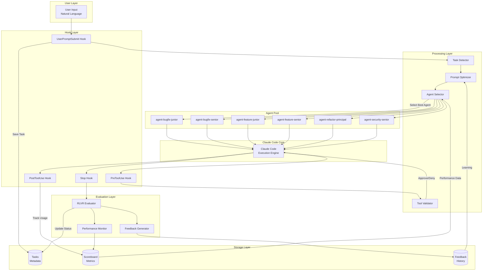
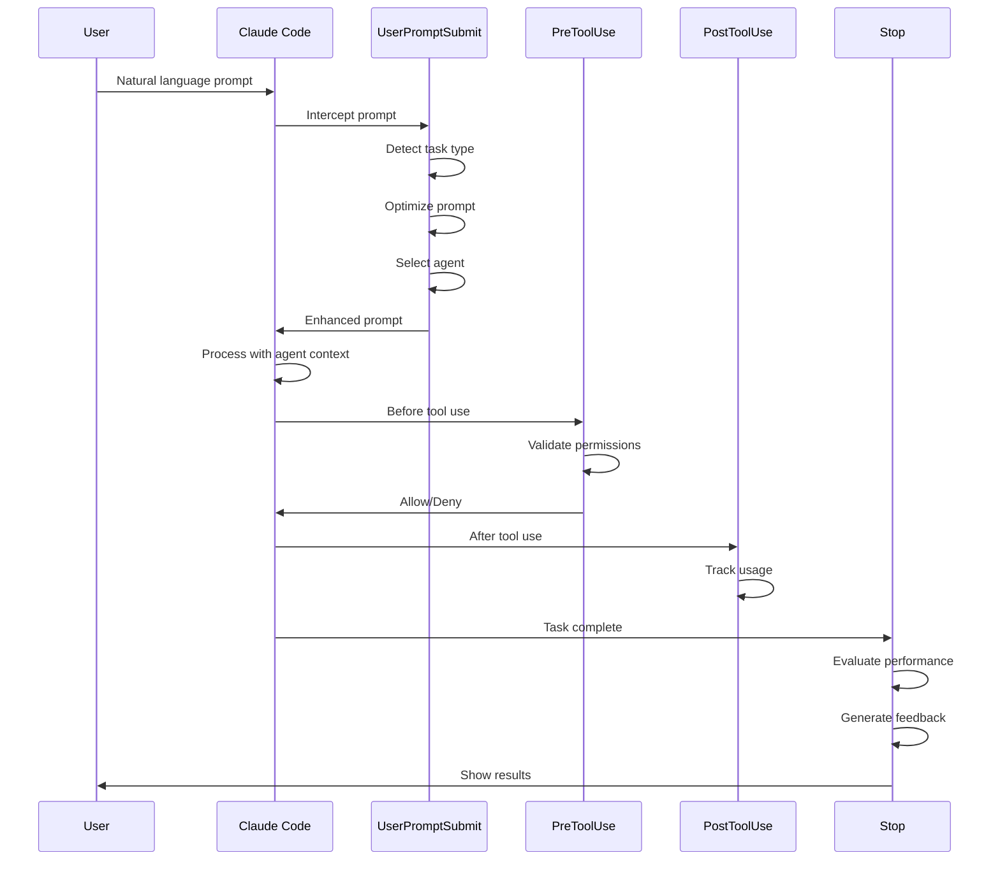
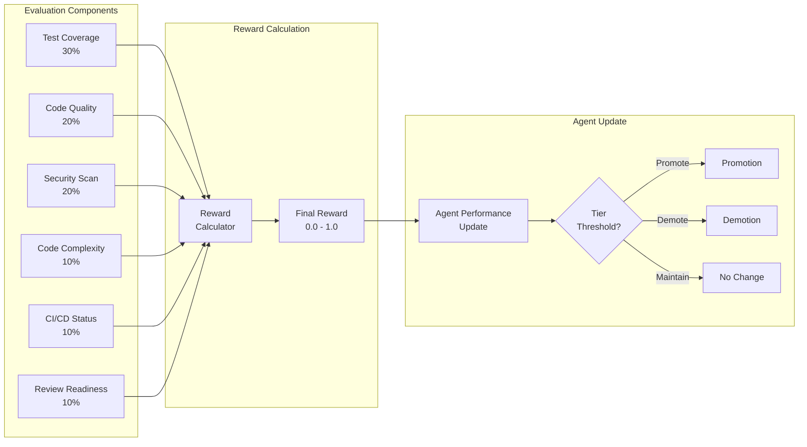
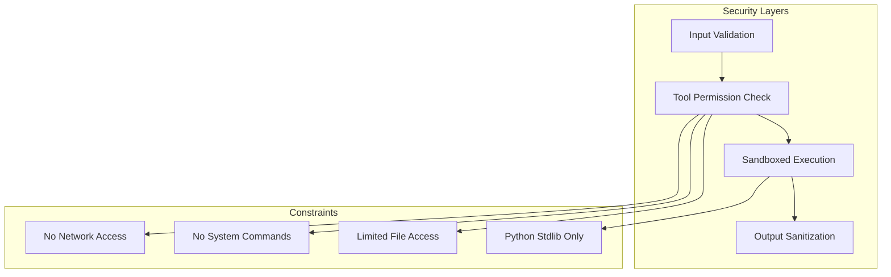

# Kiro-RLVR System Architecture

## Overview

Kiro-RLVR is a sophisticated autonomous agent system that enhances Claude Code with intelligent task routing, performance evaluation, and continuous improvement capabilities.

## System Flow Diagram



## Component Details

### 1. Hook Layer



### 2. Task Detection & Routing


### 3. RLVR Evaluation System



### 4. Data Flow


### 5. Autonomous Processing Pipeline


## Key Design Principles

### 1. **Zero Configuration**
- Works immediately after installation
- No API keys or external services required
- Intelligent defaults for all settings

### 2. **Natural Language Interface**
- No special syntax or commands needed
- Automatic intent detection
- Context-aware processing

### 3. **Continuous Learning**
- Performance tracking over time
- Feedback-driven improvements
- Adaptive agent selection

### 4. **Modular Architecture**
- Each component is independent
- Easy to extend or modify
- Clear separation of concerns

### 5. **Claude Code Native**
- Uses only standard Claude Code features
- No external dependencies
- File-based state management

## Performance Characteristics

### Latency
- Task detection: < 50ms
- Agent selection: < 100ms
- Prompt optimization: < 200ms
- Total overhead: < 500ms

### Scalability
- Handles unlimited tasks
- Efficient file-based storage
- No memory leaks or accumulation

### Reliability
- Graceful error handling
- Fallback mechanisms
- Comprehensive logging

## Security Model



## Extension Points

### Adding New Task Types
1. Update keyword detection in `UserPromptSubmit`
2. Create optimization template
3. Add specialized agent if needed

### Custom Evaluation Metrics
1. Modify `rlvr_evaluate.py`
2. Add new component to reward calculation
3. Update feedback generation

### Integration with External Tools
1. Use PreToolUse hook for validation
2. Track usage in PostToolUse
3. Include in evaluation metrics

## Monitoring & Observability

### Key Metrics
- Task completion rate
- Average reward per agent
- Task type distribution
- Tool usage patterns

### Log Files
- `events.jsonl` - All system events
- `rlvr.jsonl` - Evaluation results  
- `*_performance.jsonl` - Agent metrics
- `errors.log` - Error tracking

### Health Checks
```bash
# System status
/kiro-status

# Performance metrics
/kiro-leaderboard

# Detailed report
/kiro-report
```

## Future Enhancements

### Planned Features
1. Multi-project agent sharing
2. Advanced learning algorithms
3. Custom reward functions
4. Visual analytics dashboard

### Research Areas
1. Transformer-based task detection
2. Reinforcement learning optimization
3. Cross-agent knowledge transfer
4. Automated prompt engineering

---

This architecture ensures Kiro-RLVR provides intelligent, autonomous assistance while maintaining simplicity, security, and extensibility.