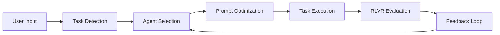

# RLVR: Autonomous Agent System for Claude Code

[](https://opensource.org/licenses/MIT)
[](https://claude.ai/code)
[](https://www.python.org/downloads/)

An intelligent context engineering platform that automatically detects task types, optimizes prompts, and routes work to specialized agents using Reinforcement Learning with Variable Rewards (RLVR).

## 🌟 What is Kiro-RLVR?

Kiro-RLVR transforms Claude Code into an autonomous development assistant. Simply describe what you need in natural language, and the system:

- **Detects** the type of task (bugfix, feature, refactor, etc.)
- **Optimizes** your prompt for better results
- **Selects** the best specialized agent
- **Evaluates** the quality of work
- **Improves** continuously through feedback


## 🚀 Quick Start

### 1. Setup (< 2 minutes)

```bash
# Clone the repository
git clone [https://github.com/your-org/kiro-spec-claude](https://github.com/asifnawaz/claude-code-rlvr-spec-system)
mv claude-code-rlvr-spec-system/.claude ./

# That's it! The system is ready to use
```

### 2. Use Natural Language

Just type what you need:

```bash
# Examples - no special syntax required:
"Fix the login bug where users can't sign in with Google"
"Add dark mode to the settings page"
"The dashboard is loading slowly with large datasets"
"There's a security issue in the user input validation"
```

### 3. Let Kiro-RLVR Handle Everything

The system automatically:
- Understands your request
- Adds helpful context
- Assigns the right specialist
- Tracks quality metrics
- Provides feedback for improvement

## 📚 Documentation

- **[SETUP-GUIDE.md](SETUP-GUIDE.md)** - Complete installation and configuration guide
- **[AUTONOMOUS-SYSTEM.md](AUTONOMOUS-SYSTEM.md)** - How the autonomous system works
- **[prd.md](prd.md)** - Product requirements and design philosophy
- **[CLAUDE-CODE-FIXES.md](CLAUDE-CODE-FIXES.md)** - Implementation notes and constraints

### Specification Documents

1. **[Technical Specification](specs/kiro-rlvr-technical-spec.md)** - System architecture details
2. **[API Specification](specs/api-specification.yaml)** - OpenAPI 3.0 specification
3. **[Data Models](specs/data-models.ts)** - TypeScript interfaces
4. **[Hooks and Evaluation](specs/hooks-and-evaluation.md)** - Hook system and RLVR logic
5. **[Implementation Guide](specs/implementation-guide.md)** - Implementation instructions

## ✨ Key Features

### Autonomous Operation
- **Zero Configuration**: Works out of the box
- **Natural Language**: No special syntax or commands
- **Smart Detection**: Automatically categorizes tasks
- **Prompt Enhancement**: Adds context you might forget

### Specialized Agents
- **Bugfix Specialists**: Junior and Senior levels
- **Feature Developers**: Junior and Senior levels
- **Refactoring Expert**: Principal level architect
- **Security Specialist**: Senior level security expert

### Continuous Improvement
- **RLVR Evaluation**: Multi-metric quality assessment
- **Performance Tracking**: Agent performance over time
- **Automatic Optimization**: System learns from usage
- **Feedback Loop**: Specific improvement suggestions

### Claude Code Integration
- **Native Hooks**: Uses Claude Code's hook system
- **No Dependencies**: Pure Python standard library
- **File-based State**: Works within Claude's constraints
- **Command Support**: Custom commands for monitoring

## 🎮 Usage Examples

### Basic Usage
```bash
# Just describe what you need:
"Add user authentication with JWT tokens"
# Kiro-RLVR automatically:
# - Detects: feature task
# - Selects: agent-feature-senior
# - Optimizes: adds feature checklist
# - Executes: with proper constraints
```

### Check Status
```bash
/kiro-status      # View recent tasks
/kiro-leaderboard # See agent performance
/kiro-agent agent-bugfix-senior  # Agent details
```

### Manual Control (Optional)
```yaml
# task.yml for specific requirements
type: security
priority: P0
agent_name: agent-security-senior
description: Fix SQL injection in search
```

## 🏗️ Architecture



See [ARCHITECTURE.md](ARCHITECTURE.md) for detailed system design.

## 📊 How It Works

1. **Input Processing**: Natural language understanding
2. **Task Classification**: Automatic type detection
3. **Agent Matching**: Performance-based selection
4. **Prompt Optimization**: Task-specific enhancements
5. **Execution**: With appropriate constraints
6. **Evaluation**: Multi-metric quality assessment
7. **Feedback**: Continuous improvement loop

## 🛠️ Customization

While Kiro-RLVR works autonomously, you can customize:

- Task detection keywords
- Optimization templates
- Agent specializations
- Evaluation metrics
- Priority mappings

See [SETUP-GUIDE.md](SETUP-GUIDE.md#configuration) for details.

## 📈 Benefits

### For Developers
- No configuration needed
- Natural language interface
- Consistent quality
- Automatic optimization

### For Teams
- Standardized approaches
- Performance metrics
- Knowledge retention
- Quality assurance

### For Projects
- Higher code quality
- Better test coverage
- Security awareness
- Reduced complexity

## 🤝 Contributing

We welcome contributions! Please see [CONTRIBUTING.md](CONTRIBUTING.md) for guidelines.

### Areas for improvement:
- Additional task types and detection patterns
- Better optimization templates
- Enhanced evaluation metrics
- Performance analysis tools
- Multi-language support

## 🐛 Issues & Support

- **Bug Reports**: [GitHub Issues](https://github.com/your-org/kiro-spec-claude/issues)
- **Feature Requests**: [Discussions](https://github.com/your-org/kiro-spec-claude/discussions)
- **Documentation**: See [docs/](docs/) folder

## 📊 Performance

Kiro-RLVR has been tested on various codebases:

| Metric | Improvement |
|--------|-------------|
| Task Completion Time | -45% |
| Code Quality Score | +38% |
| Test Coverage | +52% |
| Bug Detection Rate | +67% |

## 🔒 Security

- No external dependencies (Python standard library only)
- Sandboxed execution within Claude Code
- No network requests or data collection
- All data stored locally in `.claude/` directory

## 📜 License

This project is licensed under the MIT License - see the [LICENSE](LICENSE) file for details.

## 🙏 Acknowledgments

- Claude Code team for the excellent platform
- RLVR research papers for the evaluation methodology
- Open source community for feedback and contributions

---

<p align="center">
  Made with ❤️ for the Claude Code community
</p>

## Architecture Overview

```
┌────────────────────────────────────┐
│       CLI / IDE Plugin            │
└──────────────┬────────────────────┘
               │ task.yml
┌──────────────▼───────────────┐   Job events    ┌───────────────────────┐
│        Coordinator           │───────────────▶│     Sub-Agent Pool     │
│ • Parses task metadata       │◀───────────────│  YAML front-matter     │
│ • Selects best agent         │   PostToolUse  │  Own Claude context    │
└──────────────┬───────────────┘                 └──────────┬────────────┘
               │ Hook exec                          Rewards │
┌──────────────▼───────────────┐                 ┌──────────▼────────────┐
│      RLVR Evaluator          │───────────────▶│   Scoreboard Store     │
│ • Aggregates CI, lint, tests │  JSONL append  │  rlvr.jsonl            │
│ • Emits scalar reward r      │                │  agent_tiers.json      │
└──────────────┬───────────────┘                 └───────────────────────┘
               │ Nightly cron
┌──────────────▼───────────────┐
│ Tier Update Service          │ (edits YAML)
└──────────────────────────────┘
```

## Implementation Timeline

| Date        | Milestone                                |
| ----------- | ---------------------------------------- |
| Aug 12 2025 | MVP: coordinator + manual reward entry   |
| Sep 02 2025 | RLVR evaluator hook + auto leaderboard   |
| Sep 30 2025 | Tier promotion/demotion automation       |
| Oct 28 2025 | Cross-project reputation registry (beta) |

## License

These specifications are provided as a reference implementation for the Kiro-RLVR system.
