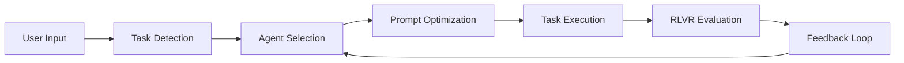
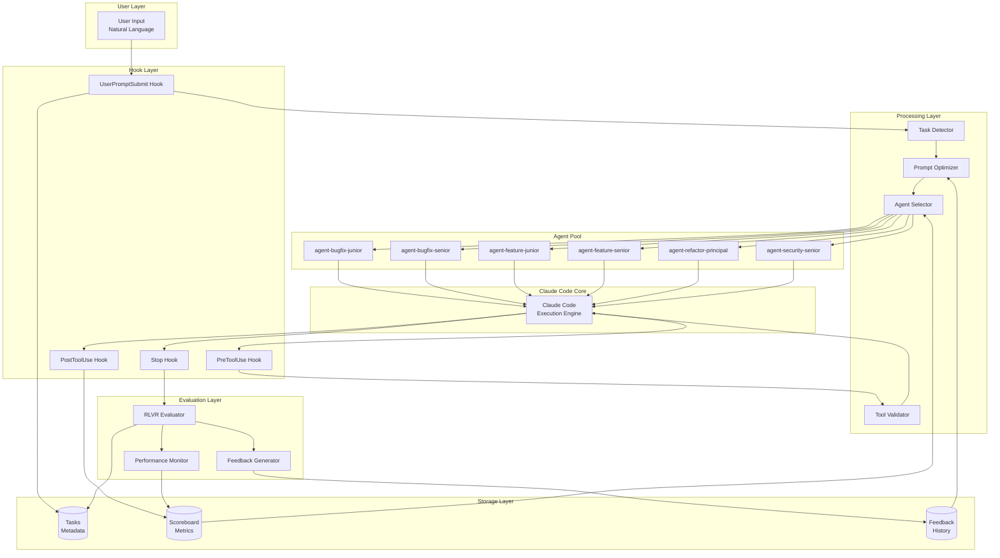
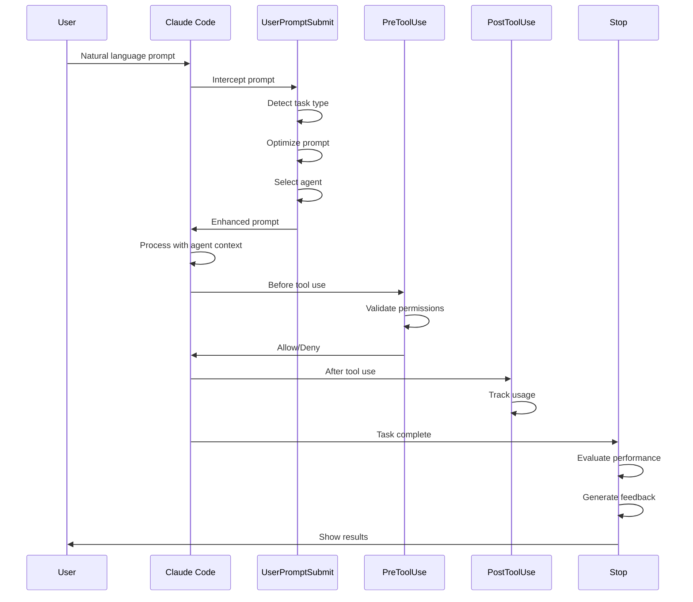
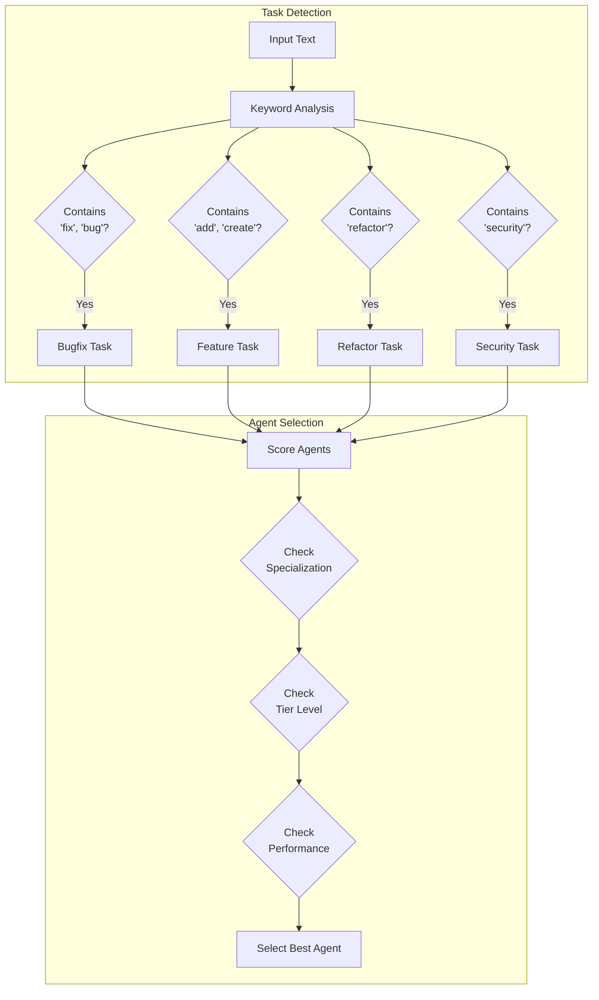
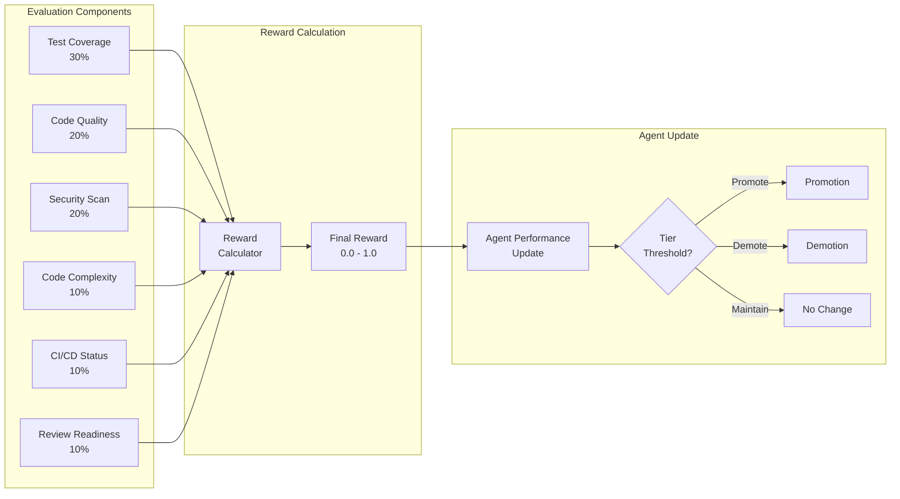
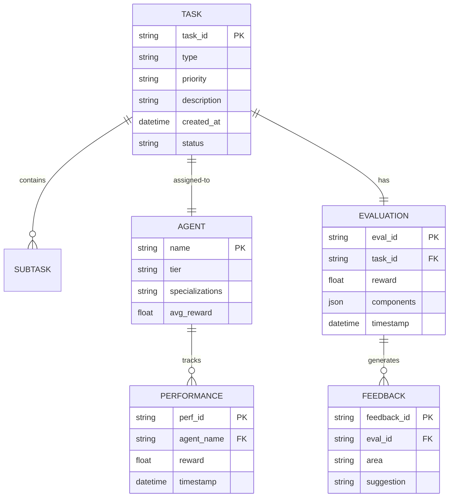
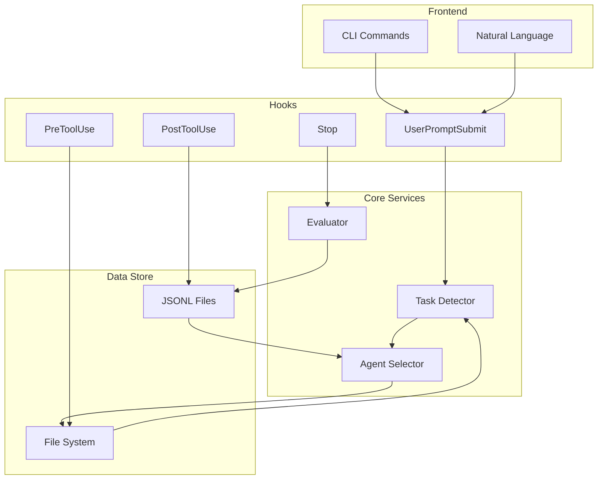
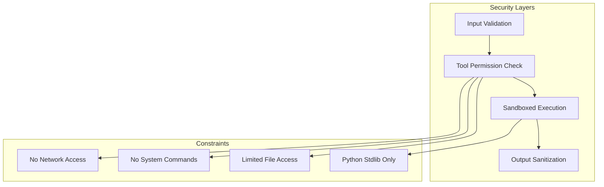
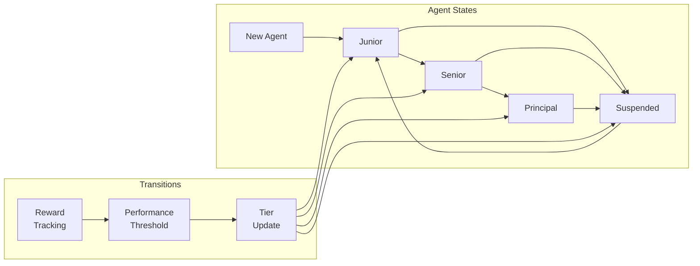

# Doom-RLVR Mermaid Diagrams

This document contains all Mermaid diagrams for the Doom-RLVR system. You can copy these into any Mermaid-compatible viewer or documentation system.

## 1. High-Level System Flow

## 2. Complete System Architecture

## 3. Hook Execution Sequence

## 4. Task Detection Flow

## 5. RLVR Evaluation Process

## 6. Data Model Relationships

## 7. State Machine

```mermaid
stateDiagram-v2
    [*] --> UserInput
    UserInput --> TaskDetection
    
    state TaskDetection {
        [*] --> AnalyzeKeywords
        AnalyzeKeywords --> DetermineType
        DetermineType --> SetPriority
        SetPriority --> [*]
    }
    
    TaskDetection --> PromptOptimization
    
    state PromptOptimization {
        [*] --> LoadTemplate
        LoadTemplate --> InjectContext
        InjectContext --> AddGuidelines
        AddGuidelines --> [*]
    }
    
    PromptOptimization --> AgentSelection
    
    state AgentSelection {
        [*] --> ScoreAgents
        ScoreAgents --> CheckSpecialization
        CheckSpecialization --> CheckPerformance
        CheckPerformance --> SelectBest
        SelectBest --> [*]
    }
    
    AgentSelection --> Execution
    
    state Execution {
        [*] --> ValidateTools
        ValidateTools --> ExecuteTask
        ExecuteTask --> TrackUsage
        TrackUsage --> [*]
    }
    
    Execution --> Evaluation
    
    state Evaluation {
        [*] --> MeasureQuality
        MeasureQuality --> CalculateReward
        CalculateReward --> GenerateFeedback
        GenerateFeedback --> UpdatePerformance
        UpdatePerformance --> [*]
    }
    
    Evaluation --> [*]
```

## 8. Component Communication

## 9. Security Model

## 10. Agent Lifecycle

## Usage

These diagrams can be:
1. Rendered in GitHub README files
2. Used in documentation tools like MkDocs
3. Copied to Mermaid Live Editor (https://mermaid.live)
4. Integrated into presentations
5. Used in technical specifications

To use in markdown, wrap the diagram code in triple backticks with `mermaid` as the language identifier.